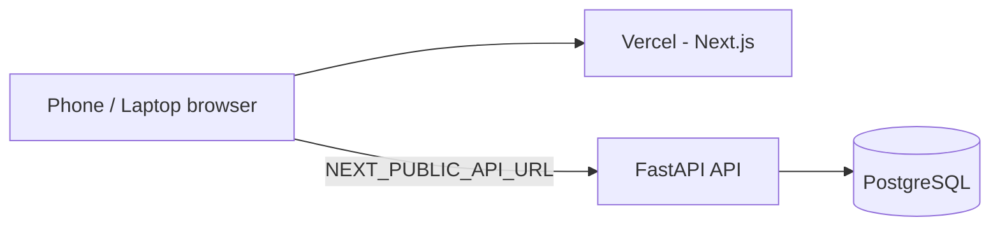

# Deployment Guide — Run on Any Device (Vercel + Public API)

This app is **two services**:

| Service | Host example | Role |
|---------|----------------|------|
| **Web** (Next.js) | Vercel | Registration, admin, scanner UI |
| **API** (FastAPI) | Render, Railway, Fly.io, VPS | Database, payments, tickets, uploads |

Vercel runs **only the frontend**. Browsers on phones/laptops call your API over **HTTPS** via `NEXT_PUBLIC_API_URL`.

---

## Checklist — Required for Production

### 1. Deploy the API (public HTTPS URL)

Deploy `apps/api` with PostgreSQL. Options:

- **Render** — use root [`render.yaml`](../render.yaml) (Blueprint)
- **Railway / Fly.io / VPS** — use `apps/api/Dockerfile`

After deploy, note the URL, e.g. `https://hyderabad-hangama-api.onrender.com`.

**API environment (minimum):**

| Variable | Required | Example |
|----------|----------|---------|
| `APP_ENV` | Yes | `production` |
| `DEBUG` | Yes | `false` |
| `SECRET_KEY` | Yes | 32+ random characters |
| `DATABASE_URL` | Yes | `postgresql+asyncpg://...` (auto-normalized from `postgres://`) |
| `API_BASE_URL` | Yes | Same as public API URL (no trailing slash) |
| `CORS_ORIGINS` | Yes | Your Vercel URL(s), comma-separated |
| `ADMIN_API_KEY` | Yes | Strong secret (match frontend below) |
| `ADMIN_DASHBOARD_URL` | Yes | `https://your-app.vercel.app/admin` |
| `PAYMENT_MODE` | Yes | `UPI_MANUAL` or `RAZORPAY` |
| `UPI_ID` | If UPI | `yourname@upi` |
| `RESEND_API_KEY` | For email | From Resend |
| `EMAIL_FROM` | For email | Verified sender |
| `AISENSY_API_KEY` | For WhatsApp | If using AiSensy |

**Why `API_BASE_URL`?** WhatsApp messages attach ticket QR images from `{API_BASE_URL}/tickets/{code}/qr`. Must be reachable from the internet (not `localhost`).

**Uploads:** Payment screenshots are stored on the API disk (`/uploads`). On ephemeral hosts (Render free), use a persistent disk or object storage for production.

### 2. Deploy the Web on Vercel

1. Import the GitHub repo in [Vercel](https://vercel.com).
2. Set **Root Directory** to `apps/web` (required — the Next.js app lives there).
3. Add **Environment Variables** (Production + Preview):

| Variable | Required | Value |
|----------|----------|--------|
| `NEXT_PUBLIC_API_URL` | **Yes** | `https://your-api.onrender.com` |
| `NEXT_PUBLIC_ADMIN_KEY` | Yes | Same as API `ADMIN_API_KEY` |
| `NEXT_PUBLIC_UPI_ID` | If UPI | Same as API `UPI_ID` |
| `NEXT_PUBLIC_RAZORPAY_KEY_ID` | If Razorpay | `rzp_live_...` |

4. Redeploy. The build runs [`verify-env.mjs`](../apps/web/scripts/verify-env.mjs) and **fails** if `NEXT_PUBLIC_API_URL` is missing or still `localhost` on Vercel.

### 3. Wire API ↔ Frontend

On the **API**, set:

```env
CORS_ORIGINS=https://your-app.vercel.app,https://your-custom-domain.com
API_BASE_URL=https://your-api.onrender.com
ADMIN_DASHBOARD_URL=https://your-app.vercel.app/admin
```

On **Vercel**:

```env
NEXT_PUBLIC_API_URL=https://your-api.onrender.com
```

### 4. External services (same as local)

| Service | Used for |
|---------|----------|
| PostgreSQL | Registrations, tickets, payments |
| Resend | Ticket / admin emails |
| AiSensy or Twilio | WhatsApp notifications |
| Razorpay | Only if `PAYMENT_MODE=RAZORPAY` |

### 5. Test from another device

1. Open `https://your-app.vercel.app/register` on a phone.
2. Complete registration / UPI flow.
3. Open `https://your-app.vercel.app/admin` (admin key).
4. Open `https://your-app.vercel.app/scanner` at the venue (camera needs HTTPS — Vercel provides this).

---

## Architecture (production)



---

## Common issues

| Symptom | Fix |
|---------|-----|
| Registration page never loads event | Set `NEXT_PUBLIC_API_URL` to public API; check API `/events` |
| CORS error in browser console | Add Vercel URL to API `CORS_ORIGINS` |
| Admin screenshots broken | `NEXT_PUBLIC_API_URL` must match API host; paths are `/uploads/...` |
| WhatsApp QR missing | Set `API_BASE_URL` on API to public HTTPS URL |
| Build fails on Vercel | Set `NEXT_PUBLIC_API_URL` in Vercel env vars, redeploy |

---

## Local vs production

| | Local | Production |
|---|--------|------------|
| Web | `http://localhost:3000` | `https://*.vercel.app` |
| API | `http://localhost:8000` | `https://api.example.com` |
| Env files | `apps/web/.env.local`, `apps/api/.env` | Vercel dashboard + API host dashboard |

See also: [ENV.md](ENV.md), [SETUP.md](SETUP.md).
