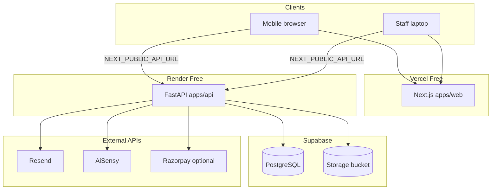

# Production Deployment Plan

**Project:** Hyderabad Hangama Club  
**Target stack:** Vercel Free (frontend) · Render Free (backend) · Supabase PostgreSQL · Supabase Storage  
**Status:** Planning only — **no code changes applied yet** (awaiting approval)  
**Last reviewed:** 2026-06-01

---

## Executive summary

This repository is a **monorepo** with a Next.js 15 frontend and a FastAPI backend. Production requires **four managed surfaces**:

| Surface | Provider | Current state |
|---------|----------|---------------|
| Frontend | Vercel | **Already live** at `https://hyderabadhangamaclub.vercel.app/` (static UI works; API calls likely still point at `localhost:8000` unless env vars were set and redeployed) |
| Backend API | Render (planned) | Not wired to production DB/storage in repo yet |
| Database | Supabase PostgreSQL (planned) | Local Docker Postgres today; `create_all` + ad-hoc SQL on startup |
| File storage | Supabase Storage (planned) | **Local disk** `uploads/screenshots/` today — **broken on Render Free** without code change |

The highest-risk gap for your chosen stack is **ephemeral filesystem on Render** combined with **local screenshot storage**. Supabase Storage is a **required code change**, not optional configuration.

---

## 1. Repository structure

```
hyderabad-hangama-club/
├── apps/
│   ├── web/                    # Next.js 15 (App Router) — DEPLOY TO VERCEL
│   │   ├── src/
│   │   │   ├── app/            # Pages: /, /register, /admin, /scanner
│   │   │   ├── features/       # RegistrationForm, EventCard
│   │   │   └── lib/env.ts      # NEXT_PUBLIC_* helpers
│   │   ├── scripts/verify-env.mjs
│   │   ├── vercel.json
│   │   ├── Dockerfile          # Dev-oriented (npm run dev)
│   │   └── package.json
│   └── api/                    # FastAPI — DEPLOY TO RENDER
│       ├── src/
│       │   ├── core/           # config.py, database.py
│       │   ├── domain/models/  # SQLAlchemy models
│       │   ├── features/       # routers + services (vertical slices)
│       │   └── infrastructure/ # Resend email, AiSensy/Twilio WhatsApp
│       ├── tests/
│       ├── Dockerfile
│       └── requirements.txt
├── docs/                       # SETUP, ENV, ARCHITECTURE, DEPLOYMENT (older)
├── docker-compose.yml          # Local: db, redis, api, web, nginx
├── render.yaml                 # Render Blueprint (includes Render Postgres — replace with Supabase)
├── nginx.conf                  # Local reverse proxy only
└── .github/workflows/ci.yml
```

**Not deployed to Vercel:** `apps/api`, Postgres, Redis, nginx, docker-compose.

---

## 2. Component identification

### 2.1 Frontend application (`apps/web`)

| Item | Detail |
|------|--------|
| Framework | Next.js 15.5, React 18, TypeScript |
| Routes | `/` (marketing + embedded booking UX), `/register`, `/admin`, `/scanner` |
| API access | Browser `fetch()` to `getApiUrl()` → `NEXT_PUBLIC_API_URL` |
| Build gate | `scripts/verify-env.mjs` fails Vercel/CI builds if `NEXT_PUBLIC_API_URL` missing or `localhost` on Vercel |
| Vercel config | `apps/web/vercel.json` — framework `nextjs` |

**API endpoints used by frontend:**

| Page / feature | HTTP | Path |
|----------------|------|------|
| Register | GET | `/events` |
| Registration | POST | `/create-order` |
| Razorpay | POST | `/payments/verify` |
| UPI manual | POST | `/payments/submit-utr` (multipart) |
| Admin | GET | `/admin/metrics`, `/admin/payments/pending`, `/admin/tickets/search` |
| Admin | POST | `/admin/payments/{id}/confirm`, `.../reject` |
| Scanner | POST | `/scanner/scan` |

**Note:** `docs/API.md` references `/api/v1` prefix — **incorrect**; live routers mount at **root** (e.g. `/events`, not `/api/v1/events`).

### 2.2 FastAPI backend (`apps/api`)

| Item | Detail |
|------|--------|
| Entry | `uvicorn src.main:app` |
| ORM | SQLAlchemy 2.0 async + `asyncpg` |
| Schema bootstrap | `Base.metadata.create_all` on startup + manual `ALTER TABLE` statements in `main.py` |
| Migrations | **No Alembic** — operational risk for schema evolution |
| Health | `GET /health/`, `GET /health/db` |
| CORS | `CORS_ORIGINS` env (comma-separated); credentials enabled when not `*` |
| Static files | `app.mount("/uploads", StaticFiles(...))` — local disk only |

**Routers included in `main.py`:**

`health`, `events`, `registrations`, `orders` (`/create-order`), `payments`, `tickets`, `scanner`, `admin`

### 2.3 Database models (`apps/api/src/domain/models/registration.py`)

| Table | Purpose |
|-------|---------|
| `events` | Event metadata, price (paise), capacity |
| `registrations` | Attendee, quantity, status (`pending`, `payment_pending`, `confirmed`, `cancelled`) |
| `payments` | Razorpay or UPI; `utr_reference`, `payment_screenshot_url`, `payment_method` |
| `tickets` | `ticket_code`, `qr_code_url` (base64 data URI in DB), scan state |

**Startup seed:** If no event named `"Tollywood Jam Night"`, one is inserted automatically.

**Payment statuses in code (not all in enum):** `initiated`, `pending_verification`, `success`, `failed`, `refunded`

### 2.4 Upload / screenshot handling

| Step | Implementation |
|------|----------------|
| Upload | `POST /payments/submit-utr` — multipart `screenshot` file |
| Validation | JPEG/PNG/WEBP/GIF, max 5 MB |
| Storage | `uploads/screenshots/{uuid}.ext` on **API container disk** |
| DB field | `payments.payment_screenshot_url` = `/uploads/screenshots/...` (relative path) |
| Serving | FastAPI `StaticFiles` at `/uploads/...` |
| Admin UI | `apiAssetUrl()` prepends `NEXT_PUBLIC_API_URL` to relative paths |

**Production blocker:** Render Free instances have **ephemeral disk**. Screenshots are **lost on restart/redeploy** unless moved to Supabase Storage (or S3-compatible object store).

### 2.5 QR generation flow

| Stage | Where | Mechanism |
|-------|--------|-----------|
| UPI payment QR | `UpiManualProvider` | `generate_qr_code_base64(upi://pay?...)` returned to frontend as `upi_qr_base64` |
| Client fallback | `RegistrationForm.tsx` | `getUpiId()` + `qrcode` npm package if server QR missing |
| Ticket QR payload | `TicketService` | `HHC:TICKET:{ticket_code}:{registration_id}` |
| Ticket QR storage | DB `tickets.qr_code_url` | `data:image/png;base64,...` |
| Ticket QR HTTP | `GET /tickets/{ticket_code}/qr` | Decodes base64 → PNG response |
| WhatsApp attachment | AiSensy | Public URL `{API_BASE_URL}/tickets/{code}/qr` — **requires `API_BASE_URL`** |
| Email / PDF | `TicketService` | QR embedded in HTML email + FPDF ticket |

### 2.6 Admin flow

```
Attendee submits UTR + screenshot
    → POST /payments/submit-utr
    → payment.status = pending_verification
    → Admin notified (AiSensy WhatsApp + Resend email, if configured)

Admin opens /admin (browser)
    → X-ADMIN-KEY header (from NEXT_PUBLIC_ADMIN_KEY — see security note)
    → GET /admin/payments/pending
    → Views screenshot via {API_URL}/uploads/...

Admin confirms
    → POST /admin/payments/{id}/confirm
    → payment.status = success, registration.confirmed
    → TicketService.generate_and_deliver_ticket()
```

### 2.7 Ticket generation flow

```
Payment confirmed (Razorpay verify/webhook OR admin confirm)
    → TicketService.generate_and_deliver_ticket()
        1. Idempotent check — existing ticket per registration
        2. ticket_code = HHC-{000001}
        3. QR base64 → tickets.qr_code_url
        4. PDF via fpdf
        5. Resend email (PDF attachment + inline QR)
        6. AiSensy WhatsApp (QR media URL = API_BASE_URL/tickets/.../qr)
        7. Commit

Scanner at event
    → POST /scanner/scan { ticket_code }
    → Marks ticket used, returns welcome / already-used
```

### 2.8 Payment modes

Controlled by `PAYMENT_MODE`:

| Mode | Flow |
|------|------|
| `UPI_MANUAL` (default in `.env.example`) | UPI QR → UTR + screenshot → admin approval |
| `RAZORPAY` | Razorpay checkout → `/payments/verify` or webhook |

### 2.9 External integrations (unchanged by host choice)

| Service | Env vars | Used for |
|---------|----------|----------|
| Resend | `RESEND_API_KEY`, `EMAIL_FROM` | Ticket + admin emails |
| AiSensy | `AISENSY_API_KEY`, campaign names | WhatsApp (primary in code paths reviewed) |
| Twilio | `TWILIO_*` | Alternate WhatsApp adapter (`whatsapp.py`) — optional |
| Razorpay | `RAZORPAY_*` | Online payments only |

### 2.10 Redis

`REDIS_URL` exists in config but **is not referenced anywhere in application code**. Safe to omit on Render for MVP.

---

## 3. Target production architecture



**Traffic pattern:** Browsers load UI from Vercel; all business logic and secrets stay on Render; DB and files on Supabase.

---

## 4. Required environment variables

### 4.1 Vercel (`apps/web`)

| Variable | Required | Example / notes |
|----------|----------|-----------------|
| `NEXT_PUBLIC_API_URL` | **Yes** | `https://hyderabad-hangama-api.onrender.com` |
| `NEXT_PUBLIC_ADMIN_KEY` | **Yes** | Must match API `ADMIN_API_KEY` (exposed in client bundle — see risks) |
| `NEXT_PUBLIC_UPI_ID` | If `UPI_MANUAL` | Same as API `UPI_ID` |
| `NEXT_PUBLIC_RAZORPAY_KEY_ID` | If `RAZORPAY` | `rzp_live_...` |

Redeploy required after any `NEXT_PUBLIC_*` change (baked at build time).

### 4.2 Render (`apps/api`)

| Variable | Required | Example / notes |
|----------|----------|-----------------|
| `APP_ENV` | Yes | `production` |
| `DEBUG` | Yes | `false` |
| `SECRET_KEY` | Yes | 32+ char random |
| `DATABASE_URL` | Yes | Supabase **Session mode** or **Transaction pooler** URI (see §5) |
| `API_BASE_URL` | **Yes** | `https://<render-service>.onrender.com` |
| `CORS_ORIGINS` | **Yes** | `https://hyderabadhangamaclub.vercel.app` |
| `ADMIN_API_KEY` | Yes | Strong secret |
| `ADMIN_DASHBOARD_URL` | Yes | `https://hyderabadhangamaclub.vercel.app/admin` |
| `PAYMENT_MODE` | Yes | `UPI_MANUAL` or `RAZORPAY` |
| `UPI_ID` | If UPI | `merchant@upi` |
| `UPI_MERCHANT_NAME` | No | Display name in UPI intent |
| `RESEND_API_KEY` | For email | |
| `EMAIL_FROM` | For email | Verified in Resend |
| `EMAIL_FROM_NAME` | No | |
| `AISENSY_API_KEY` | For WhatsApp | |
| `AISENSY_CAMPAIGN_NAME` | No | `ticket_confirmation` |
| `ADMIN_WHATSAPP_NUMBER` | Recommended | Admin payment alerts |
| `ADMIN_EMAIL` | Recommended | |
| `ADMIN_AISENSY_CAMPAIGN_NAME_ADMIN` | No | |
| `RAZORPAY_*` | If Razorpay | |
| `SUPABASE_URL` | **After code change** | `https://<project>.supabase.co` |
| `SUPABASE_SERVICE_ROLE_KEY` | **After code change** | Server-only; never on Vercel |
| `SUPABASE_STORAGE_BUCKET` | **After code change** | e.g. `payment-screenshots` |

**Omit unless needed:** `REDIS_URL` (unused in code).

### 4.3 Supabase (dashboard / CLI — not in app env on Vercel)

| Item | Purpose |
|------|---------|
| Project URL | API + Storage client |
| `service_role` key | Backend uploads (bypasses RLS) |
| `anon` key | Not needed if browser never talks to Supabase directly |
| Database password | Build `DATABASE_URL` |
| Connection strings | See §5 |

---

## 5. Required Supabase setup

### 5.1 PostgreSQL

1. Create Supabase project (region: closest to India users, e.g. `ap-south-1` if available).
2. **Settings → Database → Connection string:**
   - For Render long-running process: prefer **Session pooler** (`port 5432`) or **Direct** connection.
   - **Transaction pooler** (`port 6543`) can conflict with prepared statements in some SQLAlchemy/asyncpg setups — test early; may need `connect_args` / pool tuning.
3. Set Render `DATABASE_URL` using **URI** format. App auto-converts:
   - `postgres://` → `postgresql+asyncpg://`
   - `postgresql://` → `postgresql+asyncpg://`
4. **SSL:** Supabase requires SSL. If connection fails on Render, add asyncpg SSL in `database.py` (planned code change):
   - `connect_args={"ssl": "require"}` or equivalent.
5. **Schema:** Tables created by API startup `create_all`. For production discipline, plan Alembic or Supabase SQL migrations later.
6. **RLS:** Optional if **only** the backend connects with service DB credentials. Do not expose Supabase anon key in the frontend for this app.

### 5.2 Storage

1. Create bucket: `payment-screenshots` (or name matching `SUPABASE_STORAGE_BUCKET`).
2. **Public vs private:**
   - **Public bucket:** simpler admin UI (store full `https://...supabase.co/storage/v1/object/public/...` URL in DB).
   - **Private bucket:** store object path; API generates signed URLs for admin (more code).
3. **Policies:** Restrict writes to service role (backend uses `SUPABASE_SERVICE_ROLE_KEY`).
4. **CORS (Supabase):** If browser ever uploads directly to Storage, configure allowed origin `https://hyderabadhangamaclub.vercel.app` — current design uploads **via API**, so Storage CORS is secondary.
5. **Limits:** Free tier storage/bandwidth caps — monitor screenshot volume.

### 5.3 Supabase vs existing `render.yaml`

Root `render.yaml` provisions **Render Postgres**. For this plan, **do not use Render Postgres** — use Supabase only and remove or ignore the `databases:` block when applying Blueprint.

---

## 6. Required Render setup

### 6.1 Web service

| Setting | Value |
|---------|--------|
| Type | Web Service |
| Runtime | Docker |
| Root / context | `apps/api` (Dockerfile path) |
| Plan | Free |
| Health check | `/health/` |
| Auto-deploy | On push to `main` (optional) |

### 6.2 Free tier constraints (risks)

| Constraint | Impact |
|------------|--------|
| Ephemeral disk | Screenshots lost without Supabase Storage |
| Spin down after ~15 min idle | Cold start 30–60s; first request slow |
| 750 instance hours/month | Usually sufficient for one service |
| No persistent volume on Free | Confirms Storage migration requirement |
| Single instance | No horizontal scaling |

### 6.3 Post-deploy wiring

1. Note Render URL: `https://<service>.onrender.com`
2. Set `API_BASE_URL` to same URL
3. Set `CORS_ORIGINS` to Vercel URL(s)
4. Set `ADMIN_DASHBOARD_URL` to Vercel admin page
5. Run smoke tests: `/health/`, `/health/db`, `/events`

### 6.4 Razorpay webhooks (if used)

Register webhook URL: `https://<render-service>.onrender.com/payments/webhook` in Razorpay dashboard.

---

## 7. Required Vercel setup

### 7.1 Project settings

| Setting | Value |
|---------|--------|
| Root Directory | `apps/web` |
| Framework | Next.js (auto) |
| Node.js | 20.x |
| Build command | `npm run build` (includes `verify-env.mjs`) |

### 7.2 Existing deployment

- Production URL: **https://hyderabadhangamaclub.vercel.app/**
- Likely issue: production bundle may still use `http://localhost:8000` if `NEXT_PUBLIC_API_URL` was never set before last deploy.
- **Action:** Set env vars → **Redeploy** (required).

### 7.3 Custom domain (later)

Optional: add domain in Vercel → update `CORS_ORIGINS` and `ADMIN_DASHBOARD_URL` on Render → redeploy both.

---

## 8. Required code changes (do not implement until approved)

Planned work grouped by priority:

### P0 — Blockers for Render + Supabase

| # | Change | Files / area |
|---|--------|----------------|
| 1 | **Supabase Storage adapter** for payment screenshots | New `src/infrastructure/storage.py`; modify `payments/router.py` `_save_screenshot` |
| 2 | Store **public or signed HTTPS URL** in `payment_screenshot_url` (not `/uploads/...`) | `payments/router.py`, admin already supports absolute URLs via `apiAssetUrl` |
| 3 | **Remove or gate** local `StaticFiles` `/uploads` mount in production | `main.py` |
| 4 | **Supabase env vars** in `config.py` + `.env.example` | `core/config.py` |
| 5 | **PostgreSQL SSL** for Supabase connections | `core/database.py` |
| 6 | Add **`supabase` or `httpx`** upload dependency | `requirements.txt` |

### P1 — Production correctness

| # | Change | Files / area |
|---|--------|----------------|
| 7 | Update `render.yaml` — remove Render Postgres; document Supabase `DATABASE_URL` manual secret | `render.yaml` |
| 8 | Align `verify-env.mjs` / CI with Supabase deployment docs | `scripts/verify-env.mjs`, `.github/workflows/ci.yml` |
| 9 | Fix outdated `docs/API.md` base path (`/api/v1` → actual routes) | `docs/API.md` |
| 10 | Add `pending_verification` to `PaymentStatus` enum (consistency) | `domain/models/registration.py` |

### P2 — Hardening (recommended)

| # | Change | Files / area |
|---|--------|----------------|
| 11 | **Alembic** migrations instead of `create_all` + raw ALTER on startup | New `alembic/` |
| 12 | Move admin auth to server-side proxy or session (hide `ADMIN_API_KEY` from browser) | `apps/web` API routes + admin page |
| 13 | Rate limiting on `/scanner/scan`, `/payments/submit-utr` | Middleware or Render edge |
| 14 | Structured logging + error monitoring (Sentry) | API + Web |
| 15 | Render **persistent disk** alternative — not on Free; Storage preferred | N/A |

### P3 — Nice to have

| # | Change |
|---|--------|
| 16 | Vercel preview envs with staging API URL |
| 17 | GitHub Action deploy smoke test against `/health/db` |
| 18 | Seed event via migration/SQL instead of hardcoded startup insert |

---

## 9. Risks and blockers

### 9.1 Critical blockers

| ID | Risk | Mitigation |
|----|------|------------|
| B1 | Local filesystem uploads on Render | Implement Supabase Storage (P0) |
| B2 | Vercel site without `NEXT_PUBLIC_API_URL` | Set env + redeploy |
| B3 | `API_BASE_URL` empty | WhatsApp QR images fail | Set on Render |
| B4 | CORS mismatch | Mobile/browser blocked | Set `CORS_ORIGINS` to exact Vercel origin |

### 9.2 High risks

| ID | Risk | Mitigation |
|----|------|------------|
| R1 | `NEXT_PUBLIC_ADMIN_KEY` exposed in client JS | Anyone can call admin API if they discover URL | P2: server-side admin auth |
| R2 | Render cold starts at event peak | Upgrade plan or keep-alive ping |
| R3 | No Alembic — schema drift | P2 migrations |
| R4 | Supabase pooler + asyncpg compatibility | Test connection; use Session mode if needed |
| R5 | Free tier limits (Supabase DB size, Render hours, Vercel bandwidth) | Monitor dashboards |

### 9.3 Medium risks

| ID | Risk | Mitigation |
|----|------|------------|
| R6 | `create_all` won't drop/alter columns safely | Manual SQL or Alembic |
| R7 | Admin metrics revenue only counts `payment.status == success` | UPI pending excluded (correct) |
| R8 | Ticket QR in DB as large base64 | Acceptable at 100-seat scale |
| R9 | AiSensy / Resend failure = silent partial delivery | Logs exist; add alerting |

### 9.4 Current deployment drift

| Item | Observation |
|------|-------------|
| Live Vercel | UI accessible; API integration depends on env at last build |
| `render.yaml` | Still targets Render Postgres, not Supabase |
| `ARCHITECTURE.md` | References SendGrid; code uses **Resend** |
| Redis in docker-compose | Unused by application code |

---

## 10. Suggested deployment sequence

1. Create Supabase project (Postgres + Storage bucket).
2. Implement P0 code changes (Storage + SSL + config).
3. Deploy API to Render; verify `/health/db` and `/events`.
4. Configure Vercel env vars; redeploy frontend.
5. End-to-end test: register → UTR upload → admin confirm → email/WhatsApp → scanner.
6. Load-test cold start; document admin procedure for event day.
7. (Later) Custom domain + Alembic + admin auth hardening.

---

## 11. Approval gate

**No repository code has been modified for Supabase Storage or Render/Supabase wiring as part of this document.**

After approval, implement changes in the order defined in [DEPLOYMENT_CHECKLIST.md](./DEPLOYMENT_CHECKLIST.md).

---

## Related documents

| Document | Purpose |
|----------|---------|
| [DEPLOYMENT_CHECKLIST.md](./DEPLOYMENT_CHECKLIST.md) | Ordered task checklist |
| [DEPLOYMENT.md](./DEPLOYMENT.md) | Earlier Vercel + generic API guide |
| [ENV.md](./ENV.md) | Variable reference (update after implementation) |
